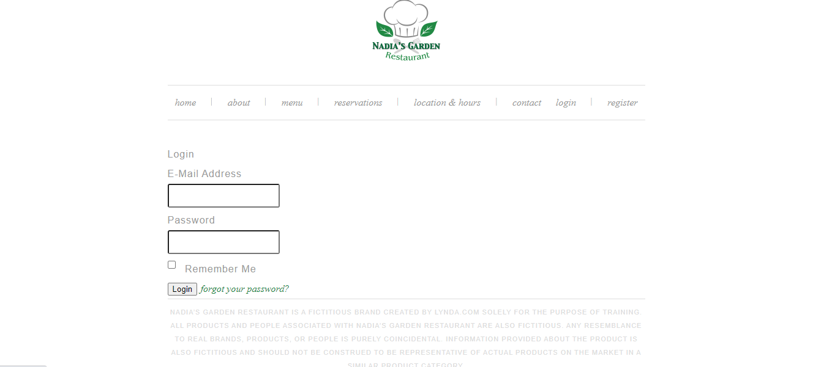
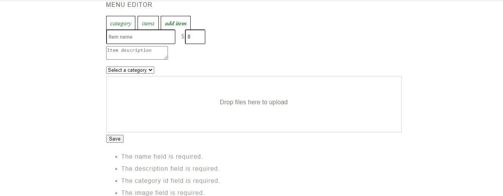
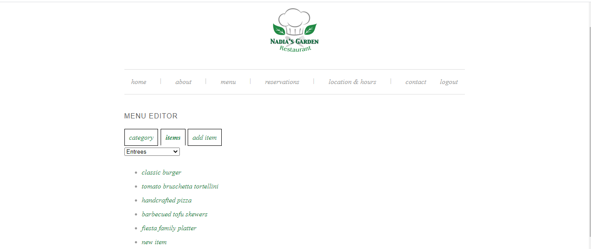
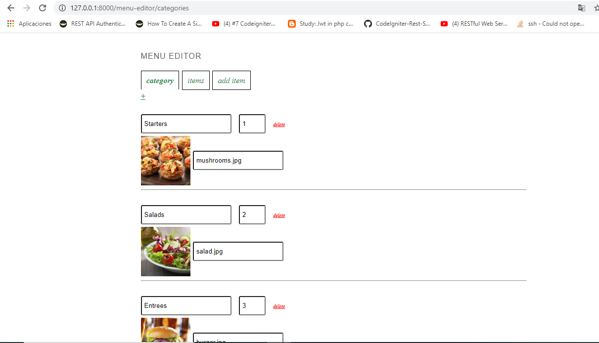

# SPA with Laravel and Vue to manage Menu items and categories using VUEX  

# Login

# new item validation

# Items by Category

# Categories (ADD, Delete and Edit)
 

# 

## Settings

clone repo. 

access main folder y execute  `npm install`. once finish run  `npm start`  

on main folder run `composer install`. then php `artisan key:generate`
replace .env.example for .env and set up your database credential inside then tun `php artisan config:cache` to refresh environment variables. 

Next step run migrtion `php artisan migrate` 

then start serving  `php artisan serve` 

